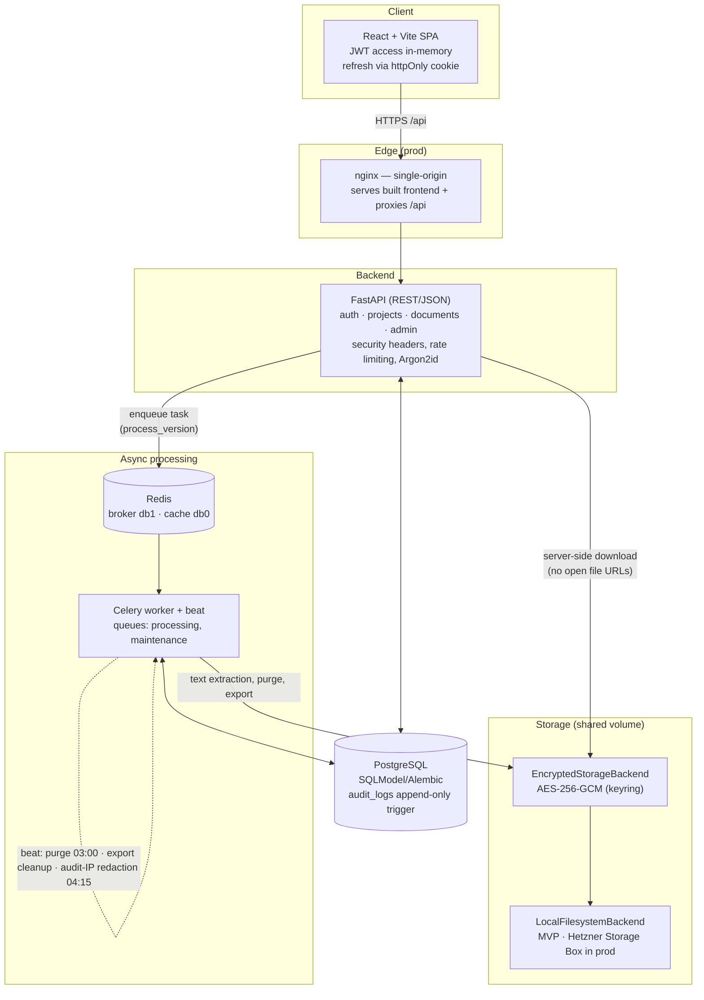

# DMS — GDPR-Oriented Document Management System (MVP)

[](https://github.com/mae240/dms/actions/workflows/ci.yml)


A lean, practical document management system for a small IT startup: managing
internal contracts, customer contracts, and project documents shared with
customers. Access is strictly **project-scoped** (Privacy by Default, GDPR Art. 25)
— customers are invited as project members (viewer/editor) to exactly the
documents that are meant to be shared, and nothing else.

I built this as a hands-on showcase for how a compliance-aware document store can
be designed end to end: a project-scoped access model, an append-only audit trail,
retention/purge automation, and application-level encryption at rest — wired
together across a small, honest FastAPI + Celery + PostgreSQL stack.

<!-- TODO: screenshot — dashboard / document detail view goes here -->

## Table of Contents

- [Highlights](#highlights)
- [Tech Stack](#tech-stack)
- [Architecture](#architecture)
- [Quickstart (Development)](#quickstart-development)
- [Manual Acceptance Walkthrough](#manual-acceptance-walkthrough)
- [GDPR Mapping](#gdpr-mapping-technical-implementation)
- [Storage & Encryption at Rest](#storage--encryption-at-rest)
- [Migrations](#migrations)
- [Tests](#tests)
- [Production](#production)

## Highlights

- **Project-scoped access model** — default is *no access*; membership roles
  `owner / admin / editor / viewer` gate every operation. Non-members receive
  `404` (existence is never leaked).
- **Encryption at rest, in-app** — a transparent `EncryptedStorageBackend`
  wraps the storage layer with AES-256-GCM and a versioned keyring; **mandatory
  in production** (the app refuses to boot without it).
- **Append-only audit log** — enforced by a PostgreSQL trigger that blocks
  `UPDATE`/`DELETE`/`TRUNCATE`; the only permitted mutation is IP redaction for
  storage-limitation compliance.
- **Retention & purge automation** — Celery Beat runs a daily purge that respects
  grace periods, legal holds, and active retention rules.
- **Document versioning + async processing** — every upload becomes a new version;
  a worker computes SHA-256, validates the real MIME type (magic bytes), and
  extracts text (PDF/DOCX).
- **GDPR subject rights** — admin-triggered JSON data export (short-lived,
  authorized, audited) and user anonymization (account disabled, PII removed,
  tokens revoked, memberships dropped).
- **Hardened auth** — Argon2id password hashing, short-lived JWT access token
  (in-memory) plus rotating refresh token in an httpOnly cookie, rate limiting,
  and security headers.

## Tech Stack

- **Frontend:** React + TypeScript + Vite, TanStack Query, a central `apiClient`
- **Backend:** Python + FastAPI (REST/JSON), SQLModel/SQLAlchemy 2.x (sync)
- **Worker:** Celery (Redis broker) — file processing, retention, export, cleanups
- **DB:** PostgreSQL · **Migrations:** Alembic · **Queue/Cache:** Redis
- **Auth:** JWT access (in-memory) + refresh (httpOnly cookie), Argon2id
- **Storage:** provider-neutral abstraction with in-app AES-256-GCM encryption at
  rest — local filesystem in the MVP, mountable Hetzner Storage Box in production
- **Containers:** Docker Compose

## Architecture

A uv-workspace monorepo built around a shared `dms_core` package (models, DB,
settings, storage, security, audit, Celery, compliance logic) — **one**
schema/migration source, shared by the backend and the worker, which prevents
schema drift.



```
packages/dms_core/   shared core (models, DB, security, storage, audit, maintenance)
backend/             FastAPI (api/, services/, schemas/, core/)
worker/              Celery tasks (processing, maintenance)
alembic/             migrations
frontend/            React + TS + Vite
docker-compose.yml   dev stack (5 services)
docker-compose.prod.yml  production override (nginx single-origin, migrate step)
```

## Quickstart (Development)

Requirements: Docker + Docker Compose.

```bash
cp .env.example .env          # values are preset for local development
make up                       # builds & starts postgres, redis, backend, worker, frontend
make migrate                  # create the database schema (alembic upgrade head)
make seed                     # create local login accounts
```

- Frontend: http://localhost:5173
- API health: http://localhost:5173/api/health (via the Vite proxy) or http://localhost:8000/api/health
- API docs (OpenAPI): http://localhost:8000/docs

**Seed accounts:**

`make seed` is idempotent and creates **user accounts only** — no demo projects or
documents. Passwords can be overridden via `SEED_ADMIN_PASSWORD` /
`SEED_TEST_PASSWORD`; the values below are the development defaults (in production
these env vars are required, otherwise seeding fails).

| Role       | E-mail            | Password       |
|------------|-------------------|----------------|
| Admin      | admin@dms.local   | adminpass123   |
| Test user  | test@dms.local    | testpass123    |

Useful make targets: `make logs`, `make ps`, `make test`, `make test-worker`,
`make revision m="..."`, `make check-migrations`, `make gen-storage-key`,
`make down`.

## Manual Acceptance Walkthrough

1. **First admin:** `POST /api/auth/register-first-admin` (only possible while no
   user exists yet) → login.
2. **Create a project** (`/projects`) — the creator becomes owner.
3. **Add a member** by e-mail with a role (owner/admin → editor/viewer).
4. **Editor uploads a document** → version 1; the worker processes it (SHA-256,
   real MIME, text extraction) → status `ready`.
5. **Second upload** → version 2; the version history shows both, the old file
   is retained.
6. **Viewer** can download but cannot upload/edit (`403`).
7. **User outside the project** receives `404` (existence is not revealed).
8. **Delete** = soft delete only (status `deleted`, restorable); restore resets
   `purge_after`.
9. **Legal hold** (admin/compliance) blocks the purge unconditionally.
10. **Audit log** records sensitive actions (append-only).
11. **Admin** creates a user data export (JSON, asynchronous, expiring).
12. **Purge job** deletes only documents that have reached their grace period and
    are **not** under legal hold or active retention.

## GDPR Mapping (Technical Implementation)

- **Art. 5 / 25 – Data minimization, Privacy by Default:** project-scoped access,
  lean list DTOs (no full text in list views), default = no access.
- **Art. 5 – Storage limitation:** `retention_until`, soft delete + `purge_after`
  grace period, worker purge; audit-IP redaction after 90 days.
- **Art. 5(2) – Accountability:** the audit log is **append-only** (a DB trigger
  blocks `UPDATE`/`DELETE`; only IP redaction is allowed).
- **Art. 15/20 – Access/Portability:** admin export of all personal data as JSON
  (short-lived, secured, audited).
- **Art. 17 – Erasure:** user anonymization (account disabled, PII removed, tokens
  revoked, memberships removed); document purge deletes all blobs.
- **Art. 30 – Records of Processing:** dedicated `processing_activities` table.
- **Art. 32 – Security:** Argon2id, JWT with rotation, httpOnly cookie,
  application-level AES-256-GCM encryption at rest, server-side download
  authorization (no open file URLs), magic-byte validation, upload limits, rate
  limiting, security headers.

### Technical & Organizational Measures (Operator Responsibilities)

Some measures are deliberately handled at the infrastructure layer and **must be
documented/enabled at deployment time**:

- **Volume/disk encryption:** in addition to the in-app blob encryption, encrypting
  the underlying DB and storage volumes (e.g. LUKS or provider-side) is recommended
  for defense in depth.
- **Backups & recoverability (Art. 32):** set up regular DB backups. Record a
  retention statement, e.g. "deletions take effect on backups after at most N days
  of rotation" — important for consistency with Art. 17.

## Storage & Encryption at Rest

The `StorageBackend` abstraction (`packages/dms_core/dms_core/storage/`) is
**provider-neutral and S3-free**: just `save/open/delete` with opaque keys, no
presigned-URL assumptions. Downloads **always** flow server-side through FastAPI.

- **Encryption at rest:** an `EncryptedStorageBackend` transparently wraps the
  active backend with **AES-256-GCM** using a versioned keyring
  (`STORAGE_ENCRYPTION_KEYS`, format `<id>:<base64-32B>,...`). The active key ID
  selects the key for new writes; older keys stay available for decryption and
  key rotation. In **production this is mandatory** — `config.py` refuses to start
  without a valid keyring. Generate a key with `make gen-storage-key`.
  Key loss = total loss of all documents → store it in a KMS/password vault.
  Existing blobs can be re-encrypted to the active key via `POST /api/admin/storage/rewrap`.
- **MVP backend:** `LocalFilesystemBackend` (a Docker volume shared between the
  backend and the worker).
- **Production backend:** the same local backend pointed at a mounted Hetzner
  Storage Box (`STORAGE_ROOT` on the CIFS/SFTP mount) — no code change required.
  A direct SFTP backend (paramiko) is *planned but not yet implemented*
  (`STORAGE_BACKEND` currently only accepts `local`).

## Migrations

```bash
make revision m="description"    # autogenerate (runs as host user, writes to alembic/versions)
make migrate                     # apply
make check-migrations            # verify models and migrations are in sync (alembic check)
```

## Tests

```bash
make test          # backend (pytest, separate Postgres test DB, transactional rollback)
make test-worker   # worker (processing pipeline)
cd frontend && npm test   # frontend smoke tests (vitest)
```

Covered, among others: auth + token rotation, project access control,
upload/versioning, download authorization, audit logging, **legal hold blocks
purge**, retention/grace period, user export, anonymization, audit-IP redaction,
and storage encryption/rewrap.

## Production

```bash
docker compose -f docker-compose.yml -f docker-compose.prod.yml \
  up -d --build postgres redis migrate backend worker web
```

- `web` (nginx) serves the built frontend **single-origin** and proxies
  `/api` → backend.
- Migrations run as a separate one-shot `migrate` step (the backend starts with
  `RUN_MIGRATIONS=false`).
- In `.env`, production **requires** `ENVIRONMENT=production`, a strong
  `JWT_SECRET`, a non-default DB password, `REFRESH_COOKIE_SECURE=true` behind
  TLS, and a valid `STORAGE_ENCRYPTION_KEYS` keyring — otherwise the app refuses
  to start.
- Do **not** start the dev `frontend` service in production.

## License

MIT — see [LICENSE](LICENSE).
